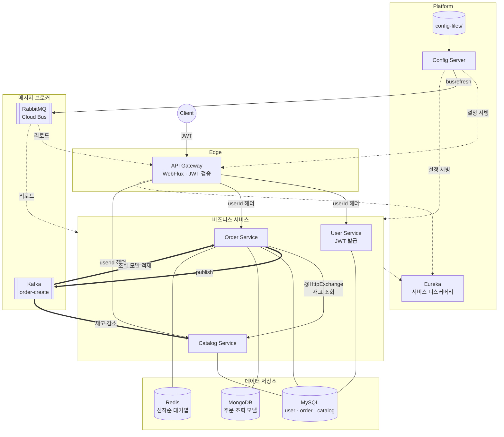

# microservice

커머스 도메인(user · order · catalog)을 소재로, MSA 환경에서 마주치는 여러 문제 — 서비스 간 인증 전파, 설정 실시간 반영, 서비스 통신, 재고 동시성, 조회 성능 등 — 을 하나씩 풀어가며 **각 문제에 어울리는 기술을 직접 붙여보고 탐구한** 프로젝트입니다.

## 기술 스택

- **Backend** Spring Boot 4.0.5-4.0.6 · Java 25 · Spring Cloud 2025.1.1 · Spring Security · JPA · Spring Data MongoDB · Spring Data Redis · Spring Kafka
- **Infra** Eureka · Spring Cloud Gateway (WebFlux) · Spring Cloud Config Server · Spring Cloud Bus (RabbitMQ) · MySQL 8 · MongoDB 7 · Redis 7 · Apache Kafka (KRaft) · Docker
- 
## 아키텍처

- **실선** : HTTP 요청/응답 흐름 (Client → Gateway → 서비스, Order → Catalog `@HttpExchange`)
- **굵은 실선** : Kafka 이벤트 흐름 (`order-create`)
- **점선** : 인프라 흐름 (Eureka 등록/조회, Config 설정 서빙, Cloud Bus 리로드)

## 주제

각 주제는 상세 문서로 이어집니다.

### [MSA 뼈대 - 서비스 디스커버리 + 게이트웨이 + JWT](docs/msa-foundation.md)
- Eureka와 Spring Cloud Gateway를 뼈대로, JWT 는 게이트웨이에서 한 번만 검증하고 확인된 userId 를 다운스트림 헤더로 전달합니다.
- 서비스 내부에서는 `ScopedValue`로 유저 컨텍스트를 안전하게 전달합니다.

### [중앙 설정 관리와 실시간 전파](docs/central-config.md)
- Config Server + Spring Cloud Bus + RabbitMQ 조합으로 재기동 없이 설정을 실시간 일괄 전파합니다.

### [서비스 간 통신 방식의 진화](docs/inter-service-communication.md)
- OpenFeign → Spring 6 `@HttpExchange`로 이전하여 `RestClient` + Eureka 로드밸런서로 구현했습니다.
- **gRPC 마이그레이션은 시도 후 폐기** — 프로젝트 규모 대비 유지보수 비용이 과해 중단했습니다.

### [Kafka 기반 비동기 이벤트](docs/async-kafka.md)
- 주문 생성 시 `order-create` 이벤트를 발행하고 Catalog 서비스가 구독해 재고를 비동기로 감소시킵니다.

### [CQRS - 주문 조회 레이어 분리](docs/cqrs-order-query.md)
- 주문의 쓰기(MySQL)와 조회(MongoDB)를 분리하고 Kafka로 동기화합니다.
- **Elasticsearch 상품 검색은 시도 후 폐기** — Spring Data Elasticsearch 의 Spring Boot 4 호환 미비 때문입니다.

### [Redis Sorted Set 기반 선착순 대기열](docs/redis-queue.md)
- `ZADD`로 순서를 관리하고, 재고 감소와 유저 pop을 **Lua Script로 원자화**하여 race condition을 방지합니다.
- 워커는 `@Scheduled`로 대기열을 소비합니다.

### [로컬 부트 매니저](docs/local-boot-manager.md)
- 7개 서비스를 브라우저에서 켜고 끄고 로그를 실시간 스트리밍하는 사이드 툴입니다.

### [관측성(Observability) - 시도 및 폐기](docs/observability-deprecated.md)
- OpenTelemetry 기반 분산 추적·대시보드를 붙여봤으나 **Spring Boot 4 호환 미비로 폐기**했습니다.